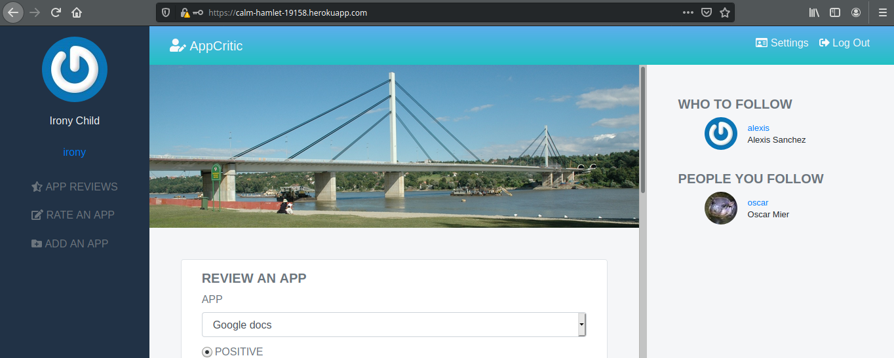
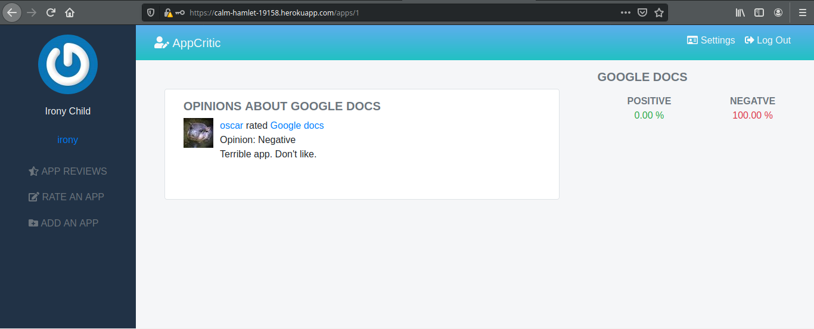

# AppCritic

> An app for sharing criticism and ratings of apps.

This is an MVP version of twitter. I've adapted it to share opinion about specific apps. User can add a new app for everyone to critique, they can follow eachother as well.

# Video Presentation

[](https://www.loom.com/share/6eb07336320d4518b695d1cc923f4d06)

# Screenshots





## Built With

- Ruby 2.6.5
- Rubocop 
- RSpec 
- Visual Studio Code 

## Live Demo

Check out the live demo [here](https://calm-hamlet-19158.herokuapp.com/)


### Prerequisites

Make sure you [install Ruby](https://www.ruby-lang.org/en/documentation/installation/) and have the following packages installed before continuing:

```
$ gem install bundler rspec foreman
```


### Install

To test Stackbot locally, clone the repository, navigate to it's containing directory, and run:

```
$ bundle install
$ ruby db:migrate
```

This should install all ruby gems. Make sure you also have a proper `application.yml` file with your [Cloudinary]() credentials. Example:

```
---
development:
  cloud_name: my_cloud_name
  api_key: '123123132123123'
  api_secret: xqPEy_xXxXxXXXxxxxXXXXxxXXx
  enhance_image_tag: true
  static_file_support: false
production:
  cloud_name: my_cloud_name
  api_key: '123123132123123'
  api_secret: xqPEy_xXxXxXXXxxxxXXXXxxXXx
  enhance_image_tag: true
  static_file_support: true
test:
  cloud_name: my_cloud_name
  api_key: '123123132123123'
  api_secret: xqPEy_xXxXxXXXxxxxXXXXxxXXx
  enhance_image_tag: true
  static_file_support: false

```


### Run tests

Running `rspec` will test AppCritic's functionalities. Navigate the `spec` directory to find out how the tests are performed.

### Deployment

You may deploy Stackbot on Heroku by running the following commands in the repo directory:

```
$ heroku create
$ git push heroku master
$ figaro heroku:set -e production
$ heroku open
```

## Author

**Oscar Mier**
- Github: [@voscarmv](https://github.com/voscarmv)
- Twitter: [@voscarmv](https://twitter.com/voscarmv)
- Linkedin: [Oscar Mier](https://www.linkedin.com/in/oscar-mier-072984196/) 

## 🤝 Contributing

Contributions, issues and feature requests are welcome!

Feel free to check the [issues page](../../issues/).

## Show your support

Give a ⭐️ if you like this project!

## Acknowledgments

- I used the [Slack Ruby Bot](https://github.com/slack-ruby/slack-ruby-bot) framework to lay the code foundation for the project.
- I used parts of the code from the [stackoverflow gem](https://github.com/antoviaque/stack-overflow-command-line) to query StackOverflow questions by using the [StackExchange API](https://api.stackexchange.com/docs/similar)
- I also used parts of the code from [fortune_gem](https://github.com/nodanaonlyzuul/fortune_gem) to build my implementation of `fortune`.
- I copied the contents of the fortune files from the [fortune-mod ubuntu package](https://launchpad.net/ubuntu/+source/fortune-mod) into my `lib/fortunes` file for my `fortune` implementation.
- I created [a prototype](https://github.com/voscarmv/stackoverflow_slack_bot/tree/feature-branch) before this project using git submodules of the aforementioned packages. I've left it in my repositories for reference.

## 📝 License

This project is MIT licensed.